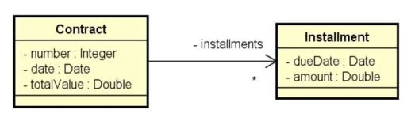
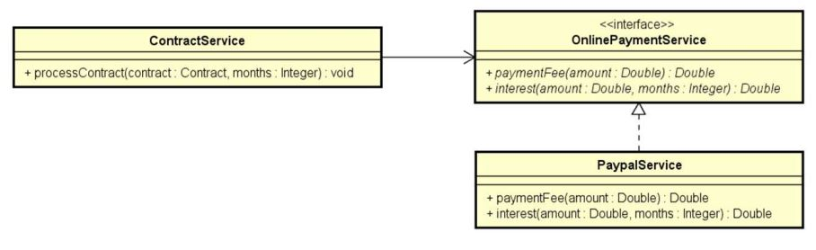

<h1 align="center"> Implementação de Interfaces </h1>

<p align="center">
Exercício em Java sobre Interfaces, Inversão de controle e Injeção de dependência  <br/>

</p>

<p align="center">
  <a href="#rocket-tecnologia">Tecnologias</a>&nbsp;&nbsp;&nbsp;|&nbsp;&nbsp;&nbsp;
  <a href="#computer-projeto">Projeto</a>&nbsp;&nbsp;&nbsp;
</p>

<p align="center">
  
</p>

<br>

## :rocket: Tecnologia

Esse projeto foi desenvolvido com a seguinte tecnologia:

- Java

## :computer: Projeto

Esse projeto tem por conceito aplicar os conhecimentos estudados pela plataforma de ensino Udemy Academy.

### Enunciado do exercício

Uma empresa deseja automatizar o processamento de seus contratos. O processamento de um contrato consiste em gerar as parcelas a serem pagas para aquele contrato, com base no número de meses desejado. 

A empresa utiliza um serviço de pagamento online para realizar o pagamento das parcelas.
Os serviços de pagamento online tipicamente cobram um juro mensal, bem como uma taxa por pagamento. 

Por enquanto, o serviço contratado pela empresa é o do Paypal, que aplica
juros simples de 1% a cada parcela, mais uma taxa de pagamento de 2%.

Fazer um programa para ler os dados de um contrato (número do contrato, data do contrato, e valor total do contrato). 
Em seguida, o programa deve ler o número de meses para parcelamento do contrato, e daí gerar os registros de parcelas a serem pagas (data e valor), sendo a primeira parcela a ser paga um mês após a data do contrato, a segunda parcela dois
meses após o contrato e assim por diante. 

Mostrar os dados das parcelas na tela.


#### Exemplo

```
Entre os dados do contrato:
Numero: 8028
Data (dd/MM/yyyy): 25/06/2018
Valor do contrato: 600.00
Entre com o numero de parcelas: 3

Parcelas:
25/07/2018 - 206.04
25/08/2018 - 208.08
25/09/2018 - 210.12

```

#### Diagrama Entities UML



#### Diagrama Sevice UML




